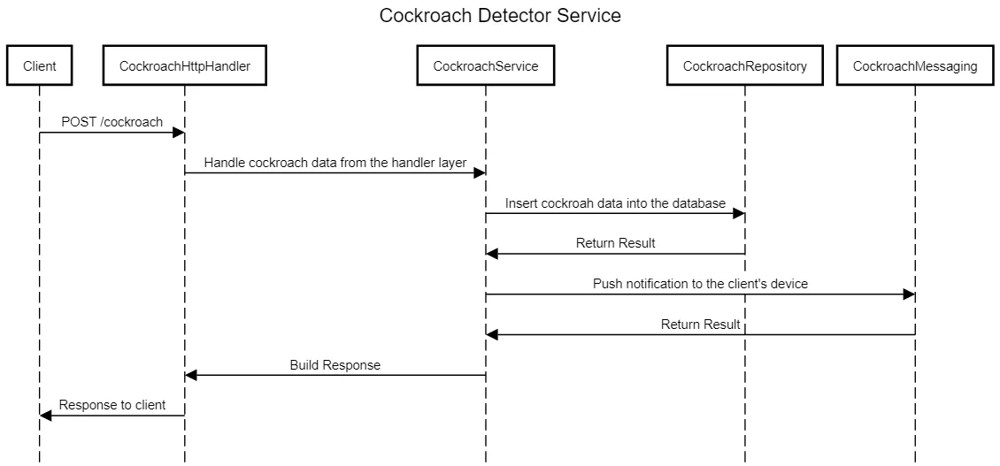

# Golang Clean Architecture V2

I have started to journey with my backend developer career for 1 year and 8 months. I have learned a success or a mistake in my coding skills.

Thus, In this article, I’m going to walk you through the topic of how to implement clean architecture in Golang and connect PostgreSQL with GORM using Docker.

It’s not just the clean architecture but I’m trying to apply the SOLID principle also.

## Project Structure

```text
📂config/
├─ 📄config.go
📂server/
├─ 📄echoServer.go
├─ 📄server.go -> interface
📂database/
├─ 📄database.go -> interface
├─ 📄postgres.go
📂cockroach/
├─ 📂tests/
│  ├─ 📄cockroach..._test.go -> need to add _test.go at the end of the file
├─ 📂migrations/
│  ├─ 📄cockroachMigration.go
│  📂entities/
│  ├─ 📄cockroachEntitiy.go
├─ 📂models/
│  ├─ 📄cockroachModel.go
├─ 📂handlers/
│  ├─ 📄cockroachHandler.go -> interface
│  ├─ 📄cockroachHttp.go
│  ├─ 📄cockroachResponse.go
├─ 📂usecases/
│  ├─ 📄cockroachUsecase.go -> interface
│  ├─ 📄cockroachUsecaseImpl.go
├─ 📂repositories/
│  ├─ 📄cockroachRepository.go -> interface
│  ├─ 📄cockroachMessaging.go -> interface
│  ├─ 📄cockroachPostgresRepository.go
│  ├─ 📄cockroachFCMMessaging.go
📄main.go
📄config.yaml
```

## Sequence Diagram of the Example

This is an API for recording the number of cockroaches sneaking into the kitchen from the closed-circuit camera detected by our AI.

